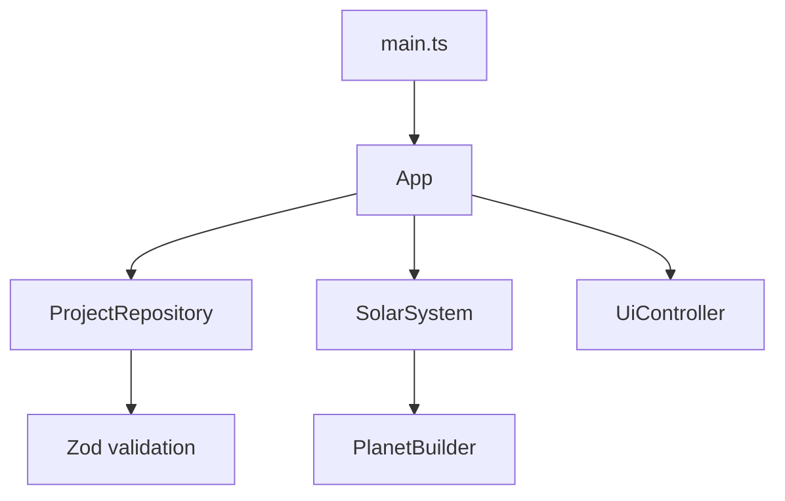
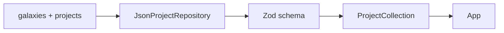

# Jelly Plants 아키텍처

이 구조의 우선순위는 처음 보는 개발자가 데이터 로딩부터 화면 표시까지의 흐름을 파일
이름만으로 따라갈 수 있게 하는 것입니다. 현재 필요한 책임만 분리하고 범용 엔진 계층은
만들지 않습니다.

## 초기화 흐름



1. `main.ts`가 DOM 루트와 WebGL2 지원 여부를 확인한 뒤 `App`을 시작합니다. WebGL2를
   사용할 수 없으면 같은 프로젝트 데이터로 링크 목록을 표시합니다.
2. `App`이 장면, 렌더러, 카메라, UI를 한 번만 구성합니다.
3. `JsonProjectRepository`가 `/data/projects.json`의 은하계와 프로젝트를 읽고
   검증합니다.
4. 검증된 프로젝트와 초기 은하계를 `SolarSystem`에 전달합니다.
5. `SolarSystem`이 `PlanetBuilder`로 행성을 만들고 궤도와 함께 장면에 추가합니다.
6. 로딩이 끝나면 `PlanetPicker`가 선택 이벤트를 `App`에 전달합니다.
7. `App`이 행성 선택, 카메라 포커스, UI 상세 정보와 브라우저 history를 함께
   갱신합니다.
8. 앱 종료 시 `dispose()`가 이벤트, WebGL 리소스와 controls를 정리합니다.

오류는 `App` 경계에서 잡습니다. 자세한 검증 경로는 콘솔에 남고, 화면에는 짧은 오류
상태가 표시됩니다.

## 장면 기반 객체

### SceneManager

Three.js `Scene`, 전역 배경, 기본 ambient light와 `SpaceBackdrop`을 소유합니다.
`SpaceBackdrop`은 far star와 near dust를 각각 한 번의 draw call로 렌더링합니다.
두 field는 서로 다른 반지름에 분포해 카메라 이동 시 자연스러운 시차를 만들고,
아주 느린 회전만 적용합니다. `MeteorField`는 한 번에 한 개의 유성만 드물게
표시합니다. reduced motion 환경에서는 회전과 유성을 모두 중지합니다.

### RendererManager

`WebGLRenderer` 생성, 색 공간, tone mapping, pixel ratio 상한과 resize를 담당합니다.
기기 pixel ratio는 최대 1.5로 제한합니다. 고해상도 화면에서는 MSAA를 끄고
pixel density 자체로 가장자리 품질을 유지해 모바일 fill-rate 비용을 줄입니다.
동일한 크기의 중복 resize 요청은 렌더러에 전달하지 않습니다.

### CameraController

Perspective camera와 `OrbitControls`를 함께 소유합니다. 기본 target은 태양이며,
pan은 끄고 damping과 최소·최대 거리를 설정합니다. OrbitControls가 마우스, 터치,
휠과 핀치 입력을 처리합니다.

행성 선택 시 `focusOn()`이 현재 카메라 위치와 행성 위치 사이를 0.75초 동안
ease-out 보간합니다. 이동 중에는 controls 입력을 잠시 막고 완료 후 선택 행성을
새 target으로 사용합니다. `FocusFollower`는 매 프레임 행성의 공전 이동량만 계산해
카메라 위치와 controls target에 함께 더합니다. 따라서 카메라는 행성을 따라가면서도
사용자가 만든 상대 회전·줌 시점을 보존하고, 행성 자전은 따라가지 않습니다. 선택 해제
시 `resetFocus()`가 태양계 기본 위치로 복귀합니다. 사용자가 reduced motion을 요청한
환경에서는 보간 없이 즉시 이동합니다.

### SolarSystem

프로젝트 목록을 장면 객체로 바꾸는 조정자입니다.

- `Sun`을 한 개 소유합니다.
- 프로젝트마다 `Planet`과 `Orbit`을 한 개씩 만듭니다.
- 은하계마다 `CosmicGarden`을 하나씩 만들고 활성 은하계의 별자리만 갱신합니다.
- 은하계를 바꾸면 비활성 행성·궤도·raycast 대상을 숨기고 항성 프로필을 바꿉니다.
- animation frame마다 각 `Planet.update(delta)`를 호출합니다.
- raycast 대상 mesh와 프로젝트의 대응 관계를 보관합니다.
- 프로젝트 ID와 런타임 행성의 대응 관계를 보관해 카메라용 world position을
  제공합니다.
- 선택·호버 상태와 dispose를 전체 행성·궤도에 전달합니다.
- 프로젝트 이름을 DOM에 투영할 world position을 제공합니다.

### Sun

중앙 구체, 두 겹의 반투명 광륜과 point light를 소유합니다. 단일 경량 셰이더가
`starProfile`의 3단계 색상, seed, 무늬 크기와 흐름 속도로 대류 무늬를 만듭니다.
두 광륜 geometry는 seed 기반으로 한 번 변형해 은하마다 다른 실루엣을 만들고 서로
반대 방향으로 천천히 움직입니다. 이미지 텍스처나 후처리 효과는 추가하지 않으며,
reduced motion 환경에서는 표면 흐름·광륜 회전·맥동을 모두 정지합니다.

### Orbit

하나의 원형 궤도 선과 경사, 궤도를 따라 흐르는 작은 광점을 표현합니다. 공전 상태를
소유하지 않으며 선택·호버된 행성의 색을 따라 가독성과 광점 밝기만 높입니다.

### Planet

한 프로젝트의 런타임 장면 객체입니다.

- 궤도 회전과 시작 각도
- 행성 자전 방향과 속도
- 축 기울기
- 행성 주변의 생명광과 빛 입자
- 고리가 없는 행성의 작은 위성
- 선택·호버 강조
- 선택 중에도 유지되는 공전
- mesh와 material dispose

프로젝트 메타데이터를 보관하지만 데이터 파일을 직접 읽지는 않습니다.

### 렌더 루프 정책

데스크톱은 디스플레이 주사율을 따르고, coarse pointer를 사용하는 모바일 환경은
30fps로 제한합니다. 문서가 background 상태가 되면 animation loop를 중지하고,
다시 보일 때 clock과 loop를 재시작해 숨겨진 탭에서 GPU를 사용하지 않습니다.

## 행성 생성

`PlanetBuilder`는 검증된 `PlanetDefinition`을 geometry와 material로 바꿉니다.
Icosahedron detail은 3으로 고정해 모바일에서 과도한 subdivision을 피합니다.

`seededNoise.ts`의 lattice value noise는 좌표와 seed만으로 같은 값을 계산합니다.
따라서 seed, 반지름, roughness, frequency가 같으면 같은 geometry가 만들어집니다.
`surfacePattern.ts`는 seed에 따라 가로 띠, 젤리 얼룩, 극지방, 흐르는 색상층,
마블형 노이즈 중 하나를 선택합니다. 같은 noise 좌표를 조합해 `baseColor`의 명도와
채도를 바꾸므로 이미지 텍스처 없이도 프로젝트마다 재현 가능한 표면 무늬가 생깁니다.

현재 파라미터에 필요하지 않은 생물군계, 셰이더 그래프, LOD 엔진 등은 의도적으로
포함하지 않습니다.

## 데이터 로딩과 검증



`ProjectRepository`는 다음 두 메서드만 노출합니다.

```ts
export interface ProjectRepository {
  getCollection(): Promise<ProjectCollection>;
  getProjects(): Promise<Project[]>;
  getProject(id: string): Promise<Project | undefined>;
}
```

`JsonProjectRepository`만 현재 JSON URL을 압니다. UI와 Three.js 코드는 fetch를 호출하지
않습니다. 나중에 API, Firebase 또는 Supabase 구현을 추가하더라도 `App`과
`SolarSystem`은 같은 인터페이스를 사용할 수 있습니다.

검증은 타입, 범위, 링크 형식, 색상 형식, rotation direction과 중복 ID를 확인합니다.
실제 `public/data/projects.json`도 테스트에서 읽어 검증하므로 잘못된 데이터는 CI에서
배포 전에 탐지됩니다.

## UI와 Three.js 경계

`UiController`는 HTML 요소, 은하계 선택기, 프로젝트 이름 라벨, 설명, 상태, 기술
스택과 선택적 GitHub 링크만 관리하며 Three.js 객체를 알지 못합니다. 카메라 이동
중에는 짧은 별빛 스트릭을, 은하계 전환 중에는 동심원 형태의 이동 효과를 DOM으로
표시합니다. `PlanetPicker`는 활성 은하계의 raycast 결과를 선택·호버 콜백으로
바꿉니다.
`App`은 선택 상태의 단일 조정자이며 아래 네 작업을 함께 수행합니다.

1. `SolarSystem.setSelected()`로 선택 강조를 적용합니다.
2. `CameraController.focusOn()` 또는 `resetFocus()`로 카메라를 이동합니다.
3. `UiController.showSelection()`으로 상세 패널을 표시하거나 닫습니다.
4. browser history에 선택 상태를 기록해 뒤로가기를 전체 화면 복귀로 연결합니다.

은하계 전환은 선택과 호버를 해제하고 카메라를 중심별로 복귀시킨 뒤 표시할 행성 라벨과
장면 객체를 함께 교체합니다. `SceneManager`와 `SpaceBackdrop`은 JSON의
`atmosphere`를 받아 배경색, 별빛, 우주 먼지와 움직임을 보간합니다. 패널 닫기, Esc,
빈 공간 선택도 모두 `App`의 동일한 선택 해제 경로를 사용합니다.
이 경계 덕분에 상세 패널 디자인을 바꿔도 raycast와 카메라 로직이 바뀌지 않습니다.

## 확장 지점

- 새 데이터 소스: `ProjectRepository` 구현 추가
- 프로젝트 상세 정보 확장: `details` JSON과 `UiController`를 함께 확장
- 프로젝트 수 증가: 라벨 충돌 회피와 별도 목록 탐색 추가
- 행성 표현: 이미지 텍스처 대신 절차적 색·재질 파라미터 확장
- 많은 행성: visibility 관리와 LOD를 실제 필요가 생긴 뒤 도입

확장 시에도 `App`은 조정, Repository는 데이터, `SolarSystem`은 장면 상태,
`UiController`는 DOM이라는 경계를 유지합니다.
