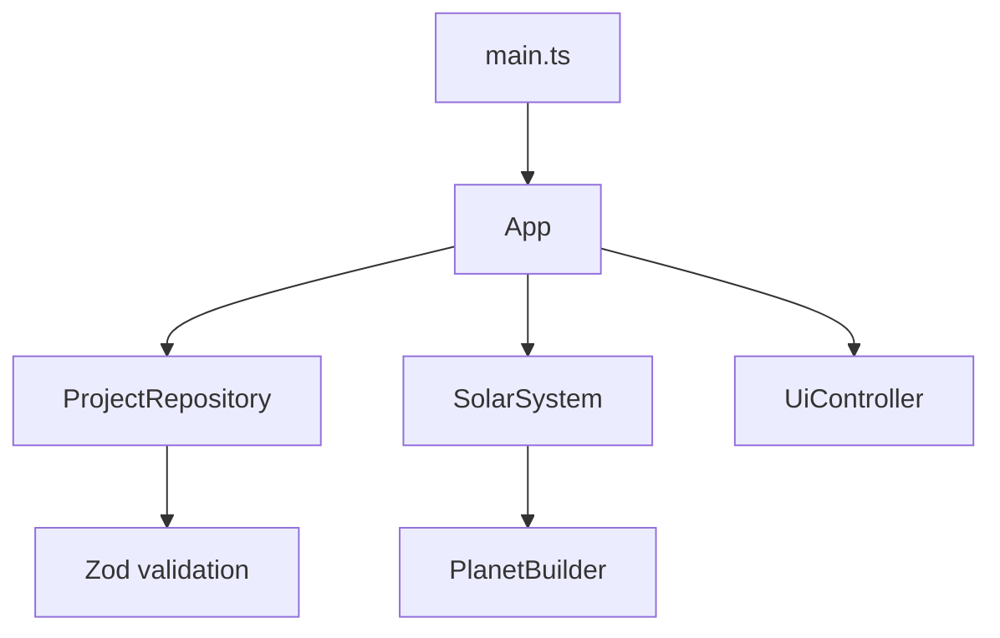
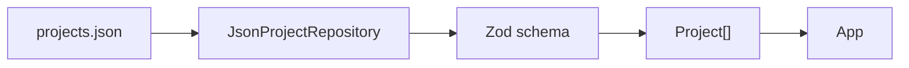

# Jelly Plants 아키텍처

이 구조의 우선순위는 처음 보는 개발자가 데이터 로딩부터 화면 표시까지의 흐름을 파일
이름만으로 따라갈 수 있게 하는 것입니다. 현재 필요한 책임만 분리하고 범용 엔진 계층은
만들지 않습니다.

## 초기화 흐름



1. `main.ts`가 DOM 루트를 찾고 `App`을 시작합니다.
2. `App`이 장면, 렌더러, 카메라, UI를 한 번만 구성합니다.
3. `JsonProjectRepository`가 `/data/projects.json`을 읽고 검증합니다.
4. 검증된 프로젝트를 `SolarSystem`에 전달합니다.
5. `SolarSystem`이 `PlanetBuilder`로 행성을 만들고 궤도와 함께 장면에 추가합니다.
6. 로딩이 끝나면 `PlanetPicker`가 선택 이벤트를 UI에 전달합니다.
7. 앱 종료 시 `dispose()`가 이벤트, WebGL 리소스와 controls를 정리합니다.

오류는 `App` 경계에서 잡습니다. 자세한 검증 경로는 콘솔에 남고, 화면에는 짧은 오류
상태가 표시됩니다.

## 장면 기반 객체

### SceneManager

Three.js `Scene`과 전역 배경, 기본 ambient light만 소유합니다.

### RendererManager

`WebGLRenderer` 생성, 색 공간, tone mapping, pixel ratio 상한과 resize를 담당합니다.
기기 pixel ratio는 최대 2로 제한합니다.

### CameraController

Perspective camera와 `OrbitControls`를 함께 소유합니다. 카메라 target은 태양이며,
pan은 끄고 damping과 최소·최대 거리를 설정합니다. OrbitControls가 마우스, 터치,
휠과 핀치 입력을 처리합니다.

### SolarSystem

프로젝트 목록을 장면 객체로 바꾸는 조정자입니다.

- `Sun`을 한 개 소유합니다.
- 프로젝트마다 `Planet`과 `Orbit`을 한 개씩 만듭니다.
- animation frame마다 각 `Planet.update(delta)`를 호출합니다.
- raycast 대상 mesh와 프로젝트의 대응 관계를 보관합니다.
- 선택 상태와 dispose를 전체 행성에 전달합니다.

### Sun

중앙 구체와 point light를 소유합니다. 행성 데이터와는 무관합니다.

### Orbit

하나의 원형 궤도 선과 경사만 표현합니다. 공전 상태를 소유하지 않습니다.

### Planet

한 프로젝트의 런타임 장면 객체입니다.

- 궤도 회전과 시작 각도
- 행성 자전 방향과 속도
- 축 기울기
- 선택 강조
- mesh와 texture dispose

프로젝트 메타데이터를 보관하지만 데이터 파일을 직접 읽지는 않습니다.

## 행성 생성

`PlanetBuilder`는 검증된 `PlanetDefinition`을 geometry와 material로 바꿉니다.
Icosahedron detail은 3으로 고정해 모바일에서 과도한 subdivision을 피합니다.

`seededNoise.ts`의 lattice value noise는 좌표와 seed만으로 같은 값을 계산합니다.
따라서 seed, 반지름, roughness, frequency가 같으면 같은 geometry가 만들어집니다.
텍스처 경로가 없으면 기본 색상만 사용합니다. 텍스처 로딩에 실패해도 경고를 남긴 뒤
기본 색상으로 계속 렌더링합니다.

현재 파라미터에 필요하지 않은 생물군계, 셰이더 그래프, LOD 엔진 등은 의도적으로
포함하지 않습니다.

## 데이터 로딩과 검증



`ProjectRepository`는 다음 두 메서드만 노출합니다.

```ts
export interface ProjectRepository {
  getProjects(): Promise<Project[]>;
  getProject(id: string): Promise<Project | undefined>;
}
```

`JsonProjectRepository`만 현재 JSON URL을 압니다. UI와 Three.js 코드는 fetch를 호출하지
않습니다. 나중에 API, Firebase 또는 Supabase 구현을 추가하더라도 `App`과
`SolarSystem`은 같은 인터페이스를 사용할 수 있습니다.

검증은 타입, 범위, 링크 형식, 색상 형식, rotation direction과 중복 ID를 확인합니다.
실제 `public/data/projects.json`도 테스트에서 읽어 검증하므로 잘못된 데이터는 CI에서
배포 전에 탐지됩니다.

## UI와 Three.js 경계

`UiController`는 HTML 요소와 문구만 관리하며 Three.js 객체를 알지 못합니다.
`PlanetPicker`는 raycast 결과를 `Project | null` 콜백으로 바꿉니다. `App`이 이 값을
받아 `SolarSystem.setSelected()`와 `UiController.showSelection()`에 각각 전달합니다.

이 경계 덕분에 선택 패널 디자인을 바꿔도 raycast 로직이 바뀌지 않고, 카메라 자동
이동을 추가해도 UI가 camera 객체를 직접 다루지 않습니다.

## 확장 지점

- 새 데이터 소스: `ProjectRepository` 구현 추가
- 프로젝트 상세 UI: `UiController` 확장 또는 작은 UI 컴포넌트 분리
- 카메라 포커스: 선택 콜백에서 별도 camera transition 객체 호출
- 행성 표현: `PlanetBuilder`에 검증된 옵션만 단계적으로 추가
- 많은 행성: visibility 관리, texture cache, LOD를 실제 필요가 생긴 뒤 도입

확장 시에도 `App`은 조정, Repository는 데이터, `SolarSystem`은 장면 상태,
`UiController`는 DOM이라는 경계를 유지합니다.
