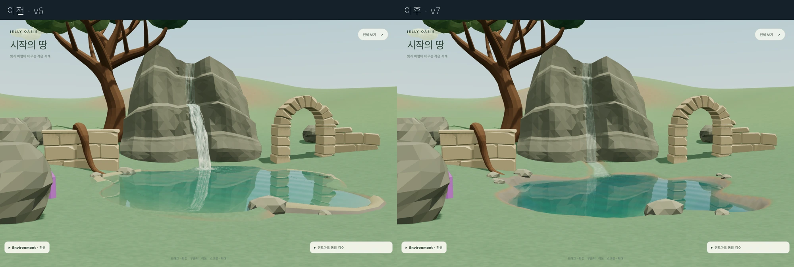
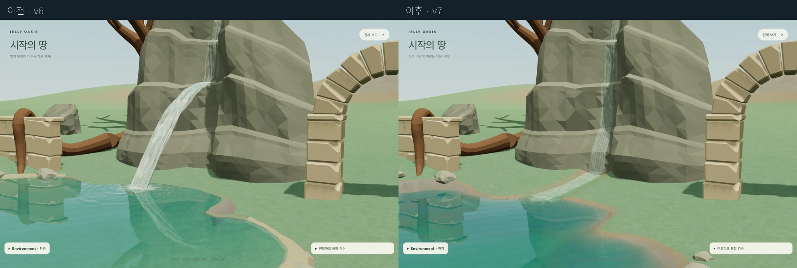
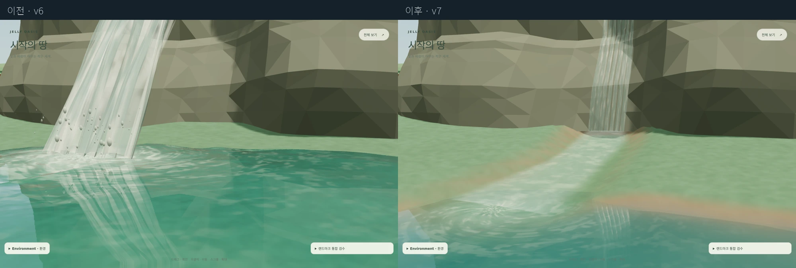
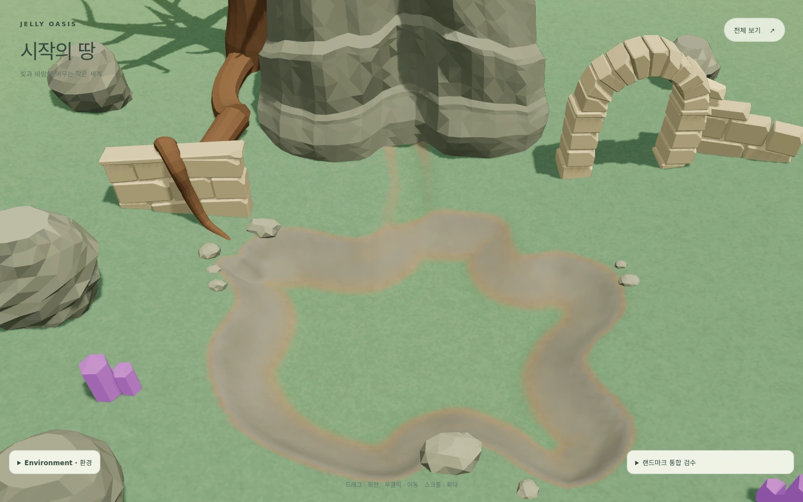

# Jelly Oasis — Basin & Continuous Watercourse v1

기준: `origin/master`의 `2b70acb22235edd5d7e5e79d34dae7c489cbca8f`. Blender 없이 Phase 0–6을 구현한 디버그 후보예요. 일반 페이지의 기본 표현은 그대로예요. 신규 바위·크리스탈·발광·장식 파티클은 추가하지 않았어요.

## 바로 확인하기

| 화면 | 링크 |
|---|---|
| 신규 v7 후보 | https://cjftya.github.io/projects/jelly-oasis/?debug&waterfall=v7&view=waterfall |
| 물을 숨긴 굴착 지형 | https://cjftya.github.io/projects/jelly-oasis/?debug&basin=excavated&waterfall=off&view=waterfall |
| 기존 v6 비교 | https://cjftya.github.io/projects/jelly-oasis/?debug&waterfall=v6&view=waterfall |
| 일반 기본 화면 | https://cjftya.github.io/projects/jelly-oasis/ |

배포 상태는 작업 완료 메시지와 `deployment-verification.json`을 참고해 주세요. `git push`와 Pages 배포 확인은 별도예요.

## Phase 0 — 측정과 설계

실제 refined GLB를 로드하고 설치 변환을 적용한 뒤 절벽 표면을 raycast했어요. 랜드마크는 `(70,58)`, yaw 30°, scale 1이고 root Y는 `-6.236676`이에요. 기존 절벽 발치는 로컬 약 `(0.015,0.565,-9.486)`, 기존 호수 수면은 로컬 `0.847606`이어서 약 28cm 역경사가 생겼어요.

새 수면은 실제 pondGuide 경계의 가장 낮은 지면보다 12cm 낮춘 로컬 `-0.074616`, 월드 `-6.311292`로 고정했어요. 호수 경계와 절벽 발치를 함께 감싸는 교체 범위는 월드 X `56–92`, Z `44–80`이에요. 이 사각형 전체를 파는 건 아니고, 내부의 basin/channel만 굴착해요. 유적·뿌리·기존 크리스탈의 지지 영역은 보호해요. 순환로와 16m 공터는 실제 굴착 범위 밖이고, 아치 접근 및 설치 높이는 그대로예요.

측정 원본: [phase0-survey.json](../artifacts/jelly-oasis/basin-watercourse-v1/phase0-survey.json).

## Phase 1 — 실제 지형 교체

`excavateTerrain.ts`가 기존 4m 격자 셀 81개의 **원래 삼각형 162개를 제거·교체**해요. 해당 영역만 0.5m 간격으로 세분화하고, 외곽 정점은 원래 격자 모서리에 맞춰 접합해요. 퇴화 삼각형을 제거한 뒤 총 10,116개의 패치 삼각형을 만들어요. 최대 굴착량은 약 2.364m이고 중앙 수심은 약 1.93m예요.

기존 평면이나 숨은 바닥을 남겨두는 겹침 메시 방식이 아니에요. 지형 전체는 하나의 geometry이고 기존 terrain 재질을 사용해요. 패치 밖의 높이와 색 계산은 기존 방식이에요.

렌더링에 업로드되는 Float32 정점과 같은 삼각형을 barycentric 보간해서 `sampleGround()`에 연결해요. 국소 sampler는 terrain config별로 등록하고, 이동·재생성 시 원래 지형과 sampler를 먼저 복구한 뒤 다시 만들어요. dispose 후에도 원래 geometry로 돌아가요.

검증: 모든 내부 가장자리의 삼각형 연결 수가 2이고, 열린 가장자리는 월드 외곽에만 있어요. 모든 면은 +Y 방향이고 700개 임의 raycast 높이와 query가 일치했어요. 수면을 숨긴 화면에서도 수로와 웅덩이 바닥을 볼 수 있어요.

## Phase 2 — 인공 테두리 제거

refined PondEdge의 `pond_role`을 읽어 연속적인 `shore/bank` 메시만 숨겨요. GLB 원본과 16개 모듈 계약은 유지해요. `rock` 소유자의 모든 재질 primitive를 동일한 높이로 이동해 재접지하므로 돌을 늘이거나 재질 조각을 따로 움직이지 않아요.

물가 경계는 지형의 경사진 bank가 만들어요. 노출된 흙/암반 색은 기존 terrain slope 재질의 결과이고 별도 링 메시가 아니에요. 수심이 거의 없는 pond fragment는 후보에서 제거해서 지면 위에 수면이 덮이지 않도록 했어요.

`shorelineGaps`는 실제 지형과 수면 높이의 교차점 오차예요. 수로 유입부는 닫힌 해안선이 아니므로 `shorelineContactTypes: channel-inlet`로 따로 기록해요.

## Phase 3 — 연속 흐름

v7은 `traceWaterFlow()`의 호수 직행 포물선을 사용하지 않아요. `traceAttachedFlow()`가 로드된 절벽의 모든 높이를 0.1m 간격으로 raycast하고, 벽면을 따라 발치까지 흐르게 해요. 발치에서는 폭 약 1.8–2.15m, 길이 약 7.86m의 수로를 따라 호수로 내려가요. 수로 중심선은 40개 표본으로 기록돼요.

흐름은 `rock-flow → rock-foot → channel → pond-inlet`이고 자유비행 시간은 0이에요. 기존 v6의 transport noise/flow 재질을 재사용하되 free-fall volume과 낙하 충돌 droplets는 생성하지 않아요. 수로 표면 모든 정점이 실제 지형보다 최소 약 9.75cm 위에 있는지 검사했고, 중심선의 물 깊이는 최소 약 0.29m예요.

## Phase 4 — 수면 통합

반사·굴절 capture, Fresnel, 수심 흡수, 비정기 directional wave packets를 유지했어요. 수심은 굴착 후 지형 query에서 계산해요. 큰 직접낙하 impact 대신 실제 유입점에 강도 0.36의 작은 파동과 얇은 포말을 넣었어요. 멀리서는 잔잔한 수면으로 바뀌어요.

후보의 반사/굴절은 데스크톱 768px, 모바일 256px이고 2개 bounded capture pass예요. 낮·밤·비, reduced motion, context loss/restore를 확인했어요.

## Phase 5 — 후속 배치 데이터

[phase2-placement.json](../artifacts/jelly-oasis/basin-watercourse-v1/phase2-placement.json)은 **랜드마크 로컬 좌표**예요. 위치의 Y는 현재 지형 sampler에서 계산한 값이에요. 각 후보는 `groundY`, `waterY`, `waterDepth`, `signedDepth`, `radius`를 포함해요.

- `shoreRockZones`: 해안 바깥 지면의 후보 9개.
- `shoreCrystalZones`: 수면 위 해안의 후보 5개.
- `underwaterCrystalZones`: 실제 바닥의 후보 3개, 수심 약 1.70–1.93m.
- `forbiddenZones`: 기존 A/B/C 크리스탈, 유적, 뿌리, 나무 기초, 절벽 뒤쪽 지지 영역.
- `channelFlowExclusion`, `routeExclusions`: 물길, 순환로, 공터, 아치 접근로의 배치 금지 자료.
- `materialHooks`: 미래 표준 emissive 재질의 반사/굴절 capture 연결 및 invalidate 지점.

후속 모델의 실루엣과 크기가 결정되면 이 반경 내에서도 실제 GLB 충돌을 다시 검사해야 해요. 이 데이터는 배치 후보이고 모델 전체의 충돌 보증은 아니에요. 이번에는 빛이나 장식을 만들지 않았어요.

## Phase 6 — 검증과 비교

- `npm run lint`: PASS.
- `npm test -- --maxWorkers=2`: 54개 파일, 297개 테스트 PASS. 마지막 진단 보정 후 basin 전용 테스트도 다시 PASS.
- `npm run build`: PASS.
- `scripts/water-realism-v1-qa.mjs`: 기존 v5/v6 회귀 검증 PASS; 최종 후보 통합 후 v6도 다시 PASS.
- `scripts/landmark-browser-qa.mjs`: 기존 지역 이동·회전·낮밤·날씨·모듈·동선·그림자 회귀, 21개 캡처 PASS. 신규 후보의 loop/clearing/approach/passage audit도 모두 clear예요.
- `scripts/basin-watercourse-qa.mjs`: v6/v7/물 없는 지형, 정면·측면·상공·지면·낮밤·비·390×844 모바일, 기본값 보존, 재생성·context recovery 검증이에요. 결과는 [qa.json](../artifacts/jelly-oasis/basin-watercourse-v1/qa.json)에 있어요.
- 지형 topology·raycast·수로 정점/바닥·보호 영역·dispose 검증: [geometry-qa.json](../artifacts/jelly-oasis/basin-watercourse-v1/geometry-qa.json).

### 전후 비교

같은 카메라·시간·날씨로 캡처했어요. 왼쪽이 기존 v6, 오른쪽이 신규 v7이에요.

6초의 시뮬레이션 변화도 [watercourse-motion.mp4](../artifacts/jelly-oasis/basin-watercourse-v1/watercourse-motion.mp4)에 있어요. 0.5초 간격의 12개 상태를 이어 붙인 2fps 비교 영상이며 실제 실시간 성능 영상은 아니에요.

### 성능 범위

모바일은 실기 접근 없이 headless Chromium의 터치/390×844 환경에서 측정했어요. `qa.json`의 `lifecycle.headlessPerformance`는 software rendering과 이 실행 환경의 프레임 스케줄링이 포함된 수치예요. 휴대전화 FPS로 해석하면 안 돼요. 데스크톱 약 2.86fps·50 calls·70,443 triangles, 모바일 약 7.90fps·29 calls·56,787 triangles로 측정됐어요. 모바일 프레임 CPU 시간은 약 3.2ms였어요. 일반 페이지에는 후보의 추가 비용이 적용되지 않아요.

재생성 3회 전후 geometry/texture 수는 데스크톱 76/6, 모바일 51/6으로 증가하지 않았어요. context restore 후 GPU 캐시 재할당 때문에 순간적인 geometry 수는 달라질 수 있어요. 이 검증은 해당 작업의 rebuild 누적 여부이며 모든 브라우저의 장시간 heap 누수를 보증하지는 않아요.

## 시각 게이트

- **PASS:** 주요 공중 점프 제거, 절벽 발치–파인 수로–웅덩이 연속성, 원래 바닥 삼각형 제거, 기존 띠 메시 제거, 기존 모델링/조명/날씨/동선 보존.
- **WARN:** 벽면 물의 가는 streak 표현은 기존 flow 재질을 재사용해서 근접 시 다소 얇고 줄무늬가 보일 수 있어요. 지형과 수면의 경계에는 작은 픽셀 aliasing이 남아 있어요. 모바일 실기 성능 및 사용자의 최종 미감 승인은 아직 미검증이에요.
- **BLOCK:** 발견된 구조적 차단 문제는 없어요. 사용자 확인 전 최종 시각 완성으로 확정하지 않아요.
