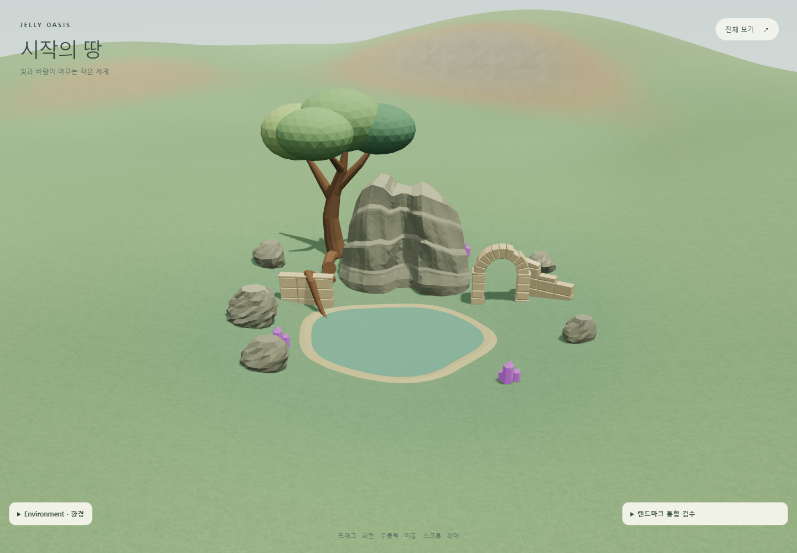

# Jelly Oasis — Cliff_Waterfall_A Detail v1

기존 세 기둥과 연결 평면을 하나의 닫힌 암벽 mesh로 상세화했다. 비대칭 정상부, 상단 유입 shelf, 좌우로 이동하는 중앙 groove, 두 주요 침식 ledge와 하단 landing을 만들었다. 기존 runtime GLB와 integration `.blend`는 보존했다. **사용자 승인에 따라 Detail v1을 기본 runtime 자산으로 적용했다.** Environment 패널과 shadow 정리는 소스에 적용했다. 사용자 요청에 따라 기본 브랜치 반영 대상으로 확정했다.

## 미리보기와 파일

- 기본 Detail v1: `/projects/jelly-oasis/`
- 기존 blockout 비교: `/projects/jelly-oasis/?debug&cliff=blockout`
- Detail v1 비교: `/projects/jelly-oasis/?debug&cliff=detail-v1`
- 두 페이지의 landmark inspector에서 `Medium` 또는 `Ground`를 선택한다.
- 일반 production 페이지는 쿼리 없이 Detail v1을 사용한다. Blockout 비교는 debug에서만 허용한다. 기존 GLB 파일은 그대로 보존한다.
- [Blender 작업 사본](../artifacts/jelly-oasis/cliff-detail-v1/jelly-oasis-cliff-detail-v1.blend)
- [별도 Detail v1 GLB](../public/assets/jelly-oasis/landmarks/overgrown-ruin/Cliff_Waterfall_A_Detail_v1.glb)
- [mesh 검증](../artifacts/jelly-oasis/cliff-detail-v1/mesh-audit.json), [browser 검증](../artifacts/jelly-oasis/cliff-detail-v1/browser-qa.json), [원본 보존 hash](../artifacts/jelly-oasis/cliff-detail-v1/preservation.json)

## 형태와 자산 검증

| 항목              | Blockout                   | Detail v1                         |
| ----------------- | -------------------------- | --------------------------------- |
| Triangles         | 2,196                      | 3,238 (+1,042)                    |
| Blender X / Y / Z | 21.327 / 11.774 / 17.000 m | 21.103 / 11.391 / 17.000 m        |
| 크기 변화         | 기준                       | 폭 −1.05%, 깊이 −3.25%, 높이 동일 |
| Origin 차이       | 기준                       | (0, 0, 0)                         |
| Scale             | (1, 1, 1)                  | (1, 1, 1)                         |
| GLB materials     | 3                          | 2 사용; 기존 rock 계열            |
| Image textures    | 0                          | 0                                 |
| GLB 크기          | —                          | 252,588 bytes                     |
| Export node       | Cliff_Waterfall_A          | Cliff_Waterfall_A_Detail_v1       |

3,238 triangles는 권장 구간 3,500–6,000보다 조금 적다. 큰 형태와 groove를 구성한 뒤 숫자를 채우기 위한 subdivision은 추가하지 않았다. 최종 mesh는 연결 성분 1개, non-manifold edge 0, loose vertex 0, duplicate vertex 0, 면적 0 face 0, winding 불일치 edge 0이다. 양의 signed volume을 갖는 닫힌 외피이며 별도 기둥끼리 겹친 내부 face를 사용하지 않는다. GLB에는 translation/rotation/scale node 보정이 없다.

상단 shelf는 약 6.5 m 폭과 약 4 m 깊이의 중앙 유입 영역으로 구성했다. 바닥은 완만하게 뒤쪽으로 올라가고 중앙은 낮아져 local −Y 방향의 전면 출구로 이어진다. Groove의 설계 폭은 상단 약 3.1 m, 중단 약 4 m, 하단 약 6.1 m이다. 중심선은 약 −0.45~+0.55 m 사이를 이동한다. 좁은 정상부 출구, 중간 ledge, 넓어지는 하단 apron이 이어지며, 좌측 정상부가 우측보다 높다. 모든 면을 동일한 각도로 꺾거나 noise modifier를 적용하지 않았다. 기존 단색 재질과 flat shading을 유지했다.

하단은 원본 기초의 hull을 기준으로 줄이고 연못 쪽 apron을 안쪽으로 정리했다. 원본 downhill anchor를 보존하고 지형 fit에 잘못 포함되던 높이 0.35 m 이하의 skirt ring을 정리하여 **runtime cliff Y −5.6715860089 m를 정확히 유지**했다. 전체 landmark 위치 X 70 / Z 58, yaw 30°, scale 1도 동일하다. 최대 표본 매몰량은 1.904 m → 1.888 m다. 상단·출구·하단의 local axis는 유지했고 연못 방향으로 열린다. 실제 수류와 연못까지의 물 연결은 후속 단계다.

동선 검사는 배치된 GLB triangle을 지형 위 0.08–3 m로 잘라 표본 검사했다. Main loop 5,040점, clearing 3,209점, approach 4,212점, passage 1,000점 모두 간섭 0이다. 아치 통로 최소 jamb 간격은 4.62 m다. 이는 표본 기반 검증이며 NavMesh나 연속 충돌 보증은 아니다. [동선 화면](../artifacts/jelly-oasis/cliff-detail-v1/movement-guides.png).

## 동일 카메라 비교

| 시점              | Before                                                                         | After                                                                        |
| ----------------- | ------------------------------------------------------------------------------ | ---------------------------------------------------------------------------- |
| Blender 정면      | [before](../artifacts/jelly-oasis/cliff-detail-v1/blender-before-front.png)    | [after](../artifacts/jelly-oasis/cliff-detail-v1/blender-after-front.png)    |
| Blender 폭포 접근 | [before](../artifacts/jelly-oasis/cliff-detail-v1/blender-before-approach.png) | [after](../artifacts/jelly-oasis/cliff-detail-v1/blender-after-approach.png) |
| Three.js medium   | [before](../artifacts/jelly-oasis/cliff-detail-v1/before-medium-noon.png)      | [after](../artifacts/jelly-oasis/cliff-detail-v1/after-medium-noon.png)      |
| Three.js ground   | [before](../artifacts/jelly-oasis/cliff-detail-v1/before-ground-noon.png)      | [after](../artifacts/jelly-oasis/cliff-detail-v1/after-ground-noon.png)      |

추가 Blender 검수: [overview](../artifacts/jelly-oasis/cliff-detail-v1/blender-after-overview.png), [좌측 3/4](../artifacts/jelly-oasis/cliff-detail-v1/blender-after-left.png), [우측 3/4](../artifacts/jelly-oasis/cliff-detail-v1/blender-after-right.png), [상단 shelf](../artifacts/jelly-oasis/cliff-detail-v1/blender-after-shelf.png). Blender 이미지는 형태 확인용 Workbench render이며 실제 조명 판단은 Three.js 이미지 기준이다.

## Shadow 점검과 수정

기존 shadow camera는 월드 원점 중심의 고정 360 m 폭이었다. 근거리에서도 약 0.352 m/texel로 넓은 영역에 해상도를 소비하고, normalBias 0.4 m는 작은 접지 형태보다 컸다. Ground 비교에서 그림자 가장자리가 퍼지고 기초 주변 연결이 약하게 보였다. 태양이 낮을 때는 terrain 자체가 만든 긴 그림자와 cliff self-shadow를 구분해 확인했다. 광원 각도와 terrain mesh는 바꾸지 않았다.

| 설정        | Before            | After / 이유                                                   |
| ----------- | ----------------- | -------------------------------------------------------------- |
| Shadow map  | 1024²             | 1024² 유지                                                     |
| Camera 반폭 | 항상 180 m        | orbit 거리 × 0.8, 45–230 m 범위                                |
| Camera 중심 | 원점              | orbit target의 X/Z; texel 간격으로 양자화                      |
| Medium 반폭 | 180 m             | 약 83.10 m, 약 0.162 m/texel                                   |
| Near / far  | 10 / 700          | 유지, 먼 caster 깊이 보존                                      |
| Bias        | −0.0002           | −0.0001                                                        |
| Normal bias | 0.4 m             | 0.12 m; 접지 이탈 감소                                         |
| Update      | 기존 frame render | 카메라 focus 변경도 반영, 동일 focus는 불필요한 환경 갱신 생략 |

이동한 shadow target만큼 sun 위치도 옮겨 광원 방향을 유지한다. Sky sun direction은 이동 전 방향에서 계산하며 단위 테스트로 검증했다. terrain과 정적 구조물의 cast/receive 정책, canopy cast 제외, 모바일 shadow-off 정책은 유지했다. 전역 shadow 기법을 교체하지 않았다.

Mesh 변경 영향을 분리하기 위해 **기존 blockout을 그대로 둔** shadow after 이미지도 저장했다: [noon medium](../artifacts/jelly-oasis/cliff-detail-v1/shadow-after-medium-noon.png), [noon ground](../artifacts/jelly-oasis/cliff-detail-v1/shadow-after-ground-noon.png), [sunset medium](../artifacts/jelly-oasis/cliff-detail-v1/shadow-after-medium-sunset.png). Before는 위 medium/ground 및 [기존 sunset](../artifacts/jelly-oasis/cliff-detail-v1/before-medium-sunset.png)과 같은 카메라다. 접지 가장자리가 또렷해졌고 검수 시점에서 줄무늬 acne나 명백한 떠 있는 그림자는 관찰되지 않았다. 낮은 태양의 긴 그림자와 terrain에 가려 어두워지는 하부는 남아 있다. 임의의 모든 orbit 위치를 보증하는 검증은 아니다.

## 환경·성능 결과

시간을 멈추고 weatherBlend가 1에 도달한 뒤 캡처했다. [Noon / CLEAR](../artifacts/jelly-oasis/cliff-detail-v1/after-medium-noon.png), [Sunset / PARTLY_CLOUDY](../artifacts/jelly-oasis/cliff-detail-v1/after-medium-sunset.png), [Night / CLEAR](../artifacts/jelly-oasis/cliff-detail-v1/after-medium-night.png), [Noon / OVERCAST](../artifacts/jelly-oasis/cliff-detail-v1/after-medium-overcast.png), [RAIN](../artifacts/jelly-oasis/cliff-detail-v1/after-medium-rain.png), [MIST](../artifacts/jelly-oasis/cliff-detail-v1/after-medium-mist.png). 밤과 안개에서 실루엣과 큰 ledge가 구분되고, 노을에서 재질의 과도한 반짝임은 보이지 않는다.

Edge headless, 1440 × 1000, DPR 1, medium 카메라, noon/CLEAR, guides 숨김 기준:

| 상태                        | Draw calls | Rendered triangles | GPU textures         |
| --------------------------- | ---------- | ------------------ | -------------------- |
| 기존 blockout / shadow on   | 73         | 45,076             | 4                    |
| Detail v1 / shadow on       | 71         | 47,160             | 4                    |
| Detail v1 / shadow off      | 40         | 27,108             | 4 (기존 할당 유지)   |
| 모바일 첫 로드 / shadow off | 40         | 27,108             | 2, shadow map 미할당 |

전체 자산 triangle은 8,002 → 9,044다. GLB primitive가 3개에서 2개로 줄어 draw call은 낮아졌다. Rendered triangles에는 terrain·환경과 활성 shadow pass가 포함된다. GPU texture 수는 GLB image texture 수와 다르다. 모바일 수치는 390 × 844 overview이므로 desktop medium과 동일 카메라 성능 비교는 아니다. GPU 시간이나 실제 휴대폰 FPS 벤치마크는 수행하지 않았다.

## Environment 패널

기존 native `details/summary`와 EnvironmentController를 재사용했다. 일반 페이지에서도 작은 `Environment · 환경` 헤더가 항상 보이고 최초 로드·새로고침은 collapsed다. Enter 키, focus 표시, `aria-expanded`, 접힌 control의 focus 차단을 확인했다. 시간, 재생/일시정지, 속도, weather 선택을 유지하며 production에서는 draw-call 통계와 debug checkbox를 숨겼다. `?debug`의 기존 inspector와 terrain control은 보존했다.

| 화면             | Collapsed                                                                    | Expanded                                                                    |
| ---------------- | ---------------------------------------------------------------------------- | --------------------------------------------------------------------------- |
| Desktop          | [보기](../artifacts/jelly-oasis/cliff-detail-v1/panel-desktop-collapsed.png) | [보기](../artifacts/jelly-oasis/cliff-detail-v1/panel-desktop-expanded.png) |
| Mobile 390 × 844 | [보기](../artifacts/jelly-oasis/cliff-detail-v1/panel-mobile-collapsed.png)  | [보기](../artifacts/jelly-oasis/cliff-detail-v1/panel-mobile-expanded.png)  |

[Mobile landscape](../artifacts/jelly-oasis/cliff-detail-v1/panel-mobile-landscape.png), [mobile debug inspector 배치](../artifacts/jelly-oasis/cliff-detail-v1/mobile-debug-layout.png). Safe-area inset을 고려하고 좁은 화면에서는 펼친 inspector가 서로 겹치지 않도록 정리했다. Screenshot viewport에서는 inset이 0이며 실제 notch 기기의 별도 실기 검증은 하지 않았다.

## 검증과 재실행

- `npm run lint`: 통과.
- `npm test -- --maxWorkers=2`: 51 files / 278 tests 통과.
- 기본 자산 전환 후 landmark/environment 관련 14개 테스트와 lint/build 재검증 통과.
- `npm run build`: TypeScript 및 production build 통과.
- `npm run qa:cliff`: production GLB 로드, 배치·접지 일치, 동선, 6개 환경, shadow on/off, 일반 페이지, keyboard/focus, time/play/speed/weather, mobile portrait/landscape, 모바일 shadow map 미할당, pagehide 정리 통과. Console/page/shader error 0.
- 원본 `Cliff_Waterfall_A.glb`는 HEAD의 bytes와 동일함을 검증했다. 기존 integration `.blend`와 배치 config는 변경하지 않았다.

서버는 `npm run preview -- --host 127.0.0.1 --port 4175`로 실행한다. QA 기본 URL은 `http://127.0.0.1:4175`이며 `CLIFF_QA_URL`, `EDGE_PATH`로 변경할 수 있다. [모델 생성 스크립트](../scripts/blender/detail_cliff_waterfall_v1.py)는 기존 Blender integration 장면에서 실행하고, [고정 카메라 render 스크립트](../scripts/blender/render_cliff_detail_v1.py)는 저장된 detail 장면에서 실행한다. 원본 before 이미지는 작업 시작 시의 코드·자산으로 캡처한 보존 자료이며 QA 재실행은 after만 갱신한다.

아직 실제 물·폭포·foam·spray·vegetation·wet material·collision mesh를 만들지 않았다. 근거리 면은 의도적으로 단순하며 낮은 태양에서 일부 strata가 띠처럼 강조된다. Detail v1 기본 적용을 완료했다. 다음 단계는 계획 순서대로 Ruin + Root Detail v1을 진행하는 것이다.
