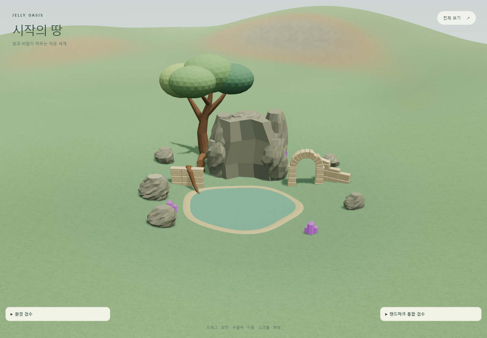

# Jelly Oasis — Landmark Integration v1

`Overgrown Oasis Ruin Blockout v1`을 실제 320 × 320 m 지형에 통합했다. 선택한 위치는 동쪽 분지 **X 70, Z 58**, yaw **30° (π/6)**, 전체 및 개별 module scale **1**이다. 기존 지형을 수정하지 않았으며, 나무 → 암벽 → 유적의 실루엣과 접근 동선을 유지했다. 상세화 전 검토할 배치 기준이며, 최종 아트 승인으로 간주하지 않는다.

기준 커밋은 `8f73b7328a867b6bedd317858e96ec30c50cee03`이다. 작업 시작 시 GitHub `master`와 일치함을 확인했다. Blender 5.2.2 LTS / MCP addon 1.8 / protocol 13의 `JellyOasis_OvergrownRuin_v1` 장면을 사용했다.

**후보 및 방향 비교**

| 후보        | X / Z     | Yaw | 80 × 76 m 범위 내 고저차 | 연못 가장자리 고저차 | 판단                                          |
| ----------- | --------- | --- | ------------------------ | -------------------- | --------------------------------------------- |
| 동쪽 분지   | 70 / 58   | 30° | 7.37 m                   | 0.73 m               | 선택. 기존 저지대를 활용하고 중앙 초원을 보존 |
| 서쪽 구릉   | -94 / -12 | 0°  | 17.38 m                  | 8.16 m               | 연못과 기초를 과도하게 변형해야 함            |
| 북쪽 고지대 | 5 / -94   | 0°  | 26.63 m                  | 12.72 m              | 기초 매몰 및 높이 차가 너무 큼                |

세 후보 모두 월드 경계 안에 들어온다. 선택한 footprint는 월드 면적의 **5.94%**이며 4 m 간격 표본에서 중앙 42 m 반경 초원과 겹치지 않는다. 면적 비율은 여유 동선까지 포함한 직사각형 기준이다.

같은 위치와 고정된 medium 카메라에서 -30°, 0°, 30°, 60°를 비교했다. 30°는 나무 줄기가 암벽 뒤에 숨는 현상을 줄이고 아치가 정면에 가깝게 열린다. 60°는 연못 지형 편차가 조금 작지만 유적과 뿌리의 배치가 더 겹쳐 보인다. [후보 서쪽](../artifacts/jelly-oasis/landmark-integration/candidate-west.png), [북쪽](../artifacts/jelly-oasis/landmark-integration/candidate-north.png), [yaw -30°](../artifacts/jelly-oasis/landmark-integration/yaw--30.png), [0°](../artifacts/jelly-oasis/landmark-integration/yaw-0.png), [30°](../artifacts/jelly-oasis/landmark-integration/yaw-30.png), [60°](../artifacts/jelly-oasis/landmark-integration/yaw-60.png).

**자산, 배치, Blender 수정**

runtime 경로는 `public/assets/jelly-oasis/landmarks/overgrown-ruin/`이다. `GLTFLoader`는 한 개이며 Rock → Arch → Cliff를 먼저 순서대로 로드한 다음 나머지를 로드한다. 전체 reference는 debug에서 요청할 때만 읽는다. 실패하면 지형을 유지하고 별도 오류 문구를 표시한다.

| 개별 GLB                   | Scale | Triangles | 처리                                                         |
| -------------------------- | ----- | --------- | ------------------------------------------------------------ |
| Rock_Large_A               | 1     | 436       | 원점, 방향, 접지, 재질, 그림자 확인                          |
| Rock_Large_B / C / D / E   | 각 1  | 각 220    | 각 원본 mesh를 별도 export                                   |
| Ruin_Arch_A                | 1     | 924       | passage 유지, 지형에 일부 매몰                               |
| Ruin_Wall_A                | 1     | 440       | 뿌리와 연결 관계 유지                                        |
| Ruin_BrokenWall_A          | 1     | 396       | local X +4 / Z +11 이동, 아치 동쪽 jamb와 연결               |
| Cliff_Waterfall_A          | 1     | 2,196     | 연결 mass +60 triangles, 원래 21.33 × 11.77 × 17 m 범위 유지 |
| Tree_Landmark_Blockout     | 1     | 1,908     | 높이 28 m 유지, canopy shadow 제외                           |
| Root_Large_A               | 1     | 356       | 여러 낮은 지지점을 사용하여 접지                             |
| Root_Tree_Base_Blockout    | 1     | 76        | 별도 module, 나무 기초 유지                                  |
| PondEdge_Blockout          | 1     | 192       | X/Z 원형상 유지, runtime에서 가장자리 높이만 적응            |
| Crystal_Blockout_A / B / C | 각 1  | 각 66     | 원래 placeholder 재질 유지                                   |
| **합계 16 modules**        | **1** | **8,002** | **image textures 0**                                         |

위 16개 파일을 모두 local origin에서 재export했다. Blender 원본 오브젝트를 옮기지 않고 임시 linked copy를 export한 후 제거했다. 처음 3개 자산의 검수 화면: [Rock](../artifacts/jelly-oasis/landmark-integration/asset-Rock_Large_A.png), [Arch](../artifacts/jelly-oasis/landmark-integration/asset-Ruin_Arch_A.png), [Cliff](../artifacts/jelly-oasis/landmark-integration/asset-Cliff_Waterfall_A.png).

첫 Three.js 화면에서 암벽이 독립 기둥처럼 보여 Blender에서 32개 vertex / 60 triangles의 연결 mass를 추가했다. 낮은 base와 후면을 연결하고 전면 중앙은 들어간 형태로 두었다. 원래 mesh datablock은 fake user로 보존했다. 상세 sculpt, texture, foliage, 최종 물/폭포 shader는 추가하지 않았다.

[수정된 Blender 사본](../artifacts/jelly-oasis/landmark-integration/jelly-oasis-overgrown-ruin-integration-v1.blend)을 저장했다. 원본 `.blend` 파일은 덮어쓰지 않았다. runtime 수정본은 `Cliff_Waterfall_A.glb`이며, `Overgrown_Oasis_Ruin_Blockout_v1.glb`는 원래 7,942 triangles의 배치 비교 reference로 유지한다. 아치 옆 broken wall 이동은 runtime config에 있으므로 Blender 사본에서는 원래 배치로 보인다.

**접지와 남은 blockout 한계**

root의 Y는 지형에서 계산한다(약 -6.237 m). 모듈은 analytic heightfield를 그대로 한 점에서 읽는 대신, 실제 4 m terrain grid의 두 triangle을 보간하고 낮은 지지 vertex들을 여러 지점에서 비교한다. downhill 쪽 부유를 피하도록 최소 fit에서 0.08 m 묻는다. 원본 geometry의 봉우리나 canopy bounds는 기초 표본에 쓰지 않는다.

가장 큰 지지점 매몰량은 암벽 **1.90 m**, 아치 **1.29 m**, 나무 **0.84 m**다. 경사지 쪽 일부 기초가 숨는 의도적인 접지이며, final geometry에서 기초 형태를 보완할 여지는 있다. 전체 스케일이나 지형을 바꾸지 않았다.

연못은 원본의 약 24.31 × 20.22 m 비정형 footprint를 사용한 48-triangle 반투명 검사 평면이다. 수면은 **Y -5.389 m**로 수평이며, rim의 안쪽/상단을 최대 **0.712 m** 올리고 바깥쪽 아래 vertex는 지면에 묻어 둔다. 이 높이 적응은 얇은 blockout rim에만 적용된다. Ground 화면에서 내부 rim과 수면 사이의 단순한 단면은 여전히 드러나며, 다음 pond-edge 모델링에서 다듬을 대상이다.

암벽 전면의 연결 면과 폭포 groove는 아직 큰 평면이고 뿌리는 각진 proxy다. 이번 검증에서는 공간과 동선을 확정했다. 폭포의 실제 연결 흐름, 물 표면 품질, 뿌리의 유기적인 굴곡은 검증 대상이 아니다.

**동선 검증**

| 항목          | 결과                               | 표본  |
| ------------- | ---------------------------------- | ----- |
| Main loop     | 6 m 폭 확보, 간섭 0                | 5,040 |
| Clearing      | 16 m 직경 확보, 간섭 0             | 3,209 |
| Arch approach | 간섭 0                             | 4,212 |
| Arch passage  | 4 m 구간 확보, 최소 jamb 약 4.62 m | 1,000 |

실제 배치된 GLB triangle을 지형 위 0.08–3 m 높이 구간으로 잘라 X/Z에 투영하고 연못 제외 영역과 함께 검사했다. 위 결과는 표본 기반 clearance 확인이며 연속 충돌 보증이나 NavMesh가 아니다. 기존 manifest의 clearing 위치가 오래되어 live Blender guide에서 실제 중심 `(0, 27)`을 추출했다. [동선 표시](../artifacts/jelly-oasis/landmark-integration/movement-guides.png), [원본 reference 비교](../artifacts/jelly-oasis/landmark-integration/layout-reference.png).

**카메라와 환경**

[Overview](../artifacts/jelly-oasis/landmark-integration/overview.png)에서 landmark는 월드의 작은 일부로 읽히고 미래 지역 공간이 충분하다. [Medium](../artifacts/jelly-oasis/landmark-integration/medium.png)에서 나무, 암벽, 아치가 분리된다. [Ground](../artifacts/jelly-oasis/landmark-integration/ground.png)는 지상 약 1.7 m 카메라에서 아치 통로, 지형 기울기, pond 크기를 보여준다.

| 조건                   | 화면                                                                   | 확인                                                        |
| ---------------------- | ---------------------------------------------------------------------- | ----------------------------------------------------------- |
| Noon / CLEAR           | [noon](../artifacts/jelly-oasis/landmark-integration/noon.png)         | 전체 형태와 재질 구분                                       |
| Sunset / PARTLY_CLOUDY | [sunset](../artifacts/jelly-oasis/landmark-integration/sunset.png)     | 긴 그림자에서도 구조 구분                                   |
| Night / CLEAR          | [night](../artifacts/jelly-oasis/landmark-integration/night.png)       | 나무는 어둡지만 실루엣 유지, crystal이 주변을 압도하지 않음 |
| Noon / OVERCAST        | [overcast](../artifacts/jelly-oasis/landmark-integration/overcast.png) | 확산광에서 유적/암벽 구분                                   |
| Noon / RAIN            | [rain](../artifacts/jelly-oasis/landmark-integration/rain.png)         | 비 속에서도 landmark 가독성 유지                            |
| Noon / MIST            | [mist](../artifacts/jelly-oasis/landmark-integration/mist.png)         | 최종 weather blend에서 확인                                 |

캡처는 시간 진행을 멈추고 `weatherBlend === 1`을 기다린다. 단순히 inspector의 이전 `100%` 문구를 기다리지 않는다. [모바일 화면](../artifacts/jelly-oasis/landmark-integration/mobile.png)은 390 × 844 touch viewport이며 shadow off를 확인했다. 모바일 inspector는 한 번에 하나만 열린다.

**성능과 수명 관리**

Edge headless, 1440 × 1000, DPR 1, noon/CLEAR, medium 카메라, guide/reference 숨김 기준이다. `renderer.info.render` 값에는 활성화된 shadow pass가 포함된다.

| 상태                      | Draw calls | Rendered triangles | GPU textures                     |
| ------------------------- | ---------- | ------------------ | -------------------------------- |
| Landmark 숨김, shadow on  | 5          | 30,768             | 4                                |
| Landmark 표시, shadow on  | 73         | 45,076             | 4                                |
| Landmark 표시, shadow off | 41         | 26,066             | 4 (이미 할당된 shadow 자원 포함) |

8,002는 GLB 자산 자체 triangle 수다. 위 render 수치는 지형, 환경, 검사 평면, shadow pass를 포함하므로 서로 다르다. GLB image textures는 0이며 renderer의 내부/그림자 texture 수와 구분한다. 최초 자산 로드와 개별 timing은 [browser-qa.json](../artifacts/jelly-oasis/landmark-integration/browser-qa.json)에 기록되어 있다. 로드 시간은 local 서버의 단일 관측값이며 네트워크 성능 보장이 아니다.

나무 trunk/root, cliff, ruin, rocks는 castShadow를 사용하며 canopy는 제외했다. terrain/ruin/rocks 등은 그림자를 받는다. 모바일은 기존 정책대로 shadow off다. geometry/material/texture는 Set으로 중복 dispose를 막고, load 실패 시 늦게 완료되는 병렬 응답까지 정리한다. reference는 요청 시 한 번만 로드한다. pagehide 이전 비동기 로드가 완료되지 않은 경우도 폐기된 scene에 추가하지 않는다.

**검증 및 재실행**

- `npm run lint`: 통과.
- `npm run build`: TypeScript 및 모든 페이지 production build 통과.
- Production preview: GLB 16개 모두 HTTP 200, `?debug` 없는 페이지의 inspector/API 없음, console/page errors 0.
- `npm test -- --maxWorkers=2`: 51 files / 277 tests 통과. 초기 무제한 병렬 실행에서 다른 프로젝트의 4개 CPU 집약 테스트가 5초 timeout을 냈고, worker 제한 후 모두 통과했다.
- 최종 변경 후 Jelly Oasis 4 files / 20 tests 재검증 통과.
- `npm run qa:landmark`: 실제 GLB 16개, reference 1개, debug 제어, 개별 자산, 후보/회전 비교, 3개 카메라, 6개 환경, mobile shadow, 의도적인 404 오류 처리, pagehide 정리 검증. 정상 경로 console/page errors 0.

`npm ci` 후 `npm run dev -- --host 127.0.0.1`로 실행하고 `/projects/jelly-oasis/?debug`를 연다. QA 스크립트는 설치된 Microsoft Edge를 사용한다. 다른 서버는 `LANDMARK_QA_URL`로 지정한다. 코드, screenshot, Blender 사본, 기계 판독 가능한 QA 결과는 모두 이 저장소에서 함께 관리한다.

상세화 우선순위는 **암벽의 연결 mass/groove → 유적의 파손과 root 접합 → 나무 branch/root/canopy → pond edge → crystal accent**다. 현재 배치 검토 후 진행한다.
