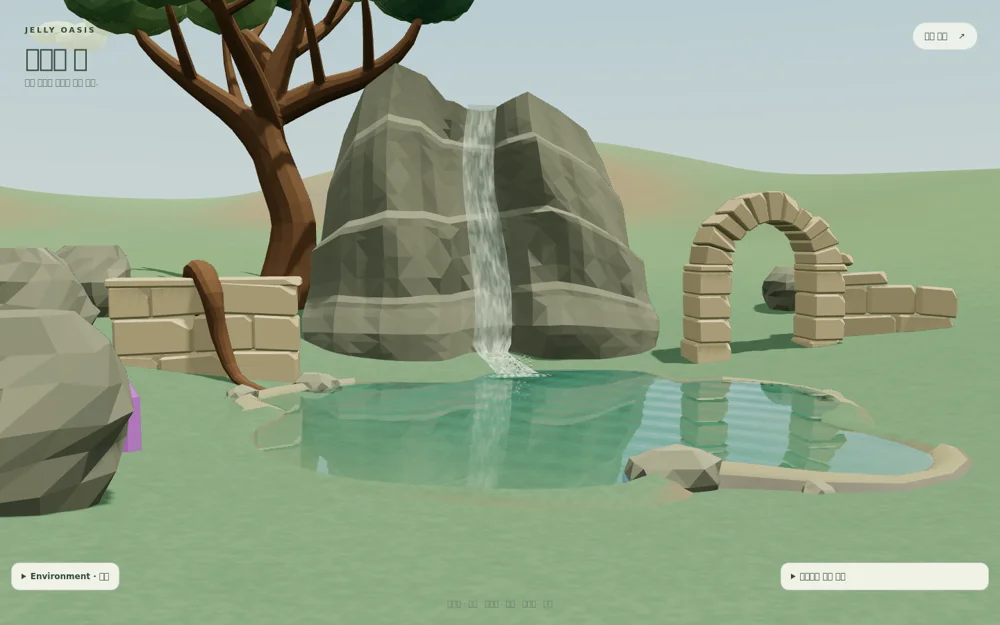

# Reflective pond v2 and waterfall v3

The previous colored water ribbon looked substantially simpler than the surrounding scene. This candidate changes the rendering method instead of increasing only geometry detail.

## Visible behavior

The pond now captures the actual scene above and below its existing water plane. Cliff, arch, sky, and waterfall reflections are distorted by animated normals; the view angle controls reflection through a Fresnel term. Ground below the surface is refracted, with depth-dependent absorption and color. Directional sun/moon lighting, highlights, and scene fog remain active. Geometry, water level, bank placement, and shoreline are preserved.

The waterfall uses a thin, two-sided physical water sheet with an index of refraction of 1.333, transmission, moving fine normals, and a separate irregular aeration veil. Soft procedural foam replaces solid polygon patches. Forty smaller rounded droplets replace the coarse splash pieces. Existing waterfall v1/v2 and water v1 remain available for comparison.

Review: `/projects/jelly-oasis/?debug&water=v2&waterfall=v3`.
The normal scene is unchanged; this higher-cost version is a debug candidate.

## Rendering cost and lifecycle

- Planar reflection/refraction targets: 768 × 768 desktop, 256 × 256 mobile, with multisampling disabled.
- Two additional planar scene captures. Stationary-view updates are limited to 20 Hz desktop / 10 Hz mobile. Camera changes refresh immediately; time/weather/shadow/context changes invalidate the captures. Physical waterfall transmission adds its own Three.js scene pass.
- Two deterministic 128 × 128 textures are generated locally for normal detail and soft foam; there are no external texture requests or GLB changes.
- Reduced motion stops flow and splash animation and reuses static captures. Camera and environment controls still refresh the reflection.
- Capture targets, materials, texture resources, instanced buffers, and geometry are released on disposal. Rebuilds preserve the existing scene ownership.

## Validation

- TypeScript/Vite production build, ESLint, and the existing 52-file / 294-test suite pass.
- `scripts/realistic-water-qa.mjs` checks desktop/mobile front, side, close, and night views; valid shared-pond connections; finite descending paths; effect triangles below 8,000; animation/reduced motion; static capture reuse; shadow/time invalidation; WebGL loss/restoration; and browser console errors.
- Eight review images and snapshots are in `artifacts/jelly-oasis/realistic-water-v3/`.
- Real-device frame rate, GPU time, and thermal behavior are not measured; software-browser rendering is not a device performance benchmark.

