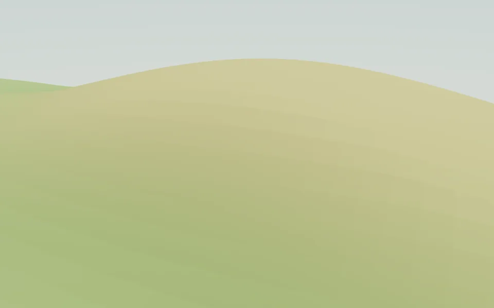
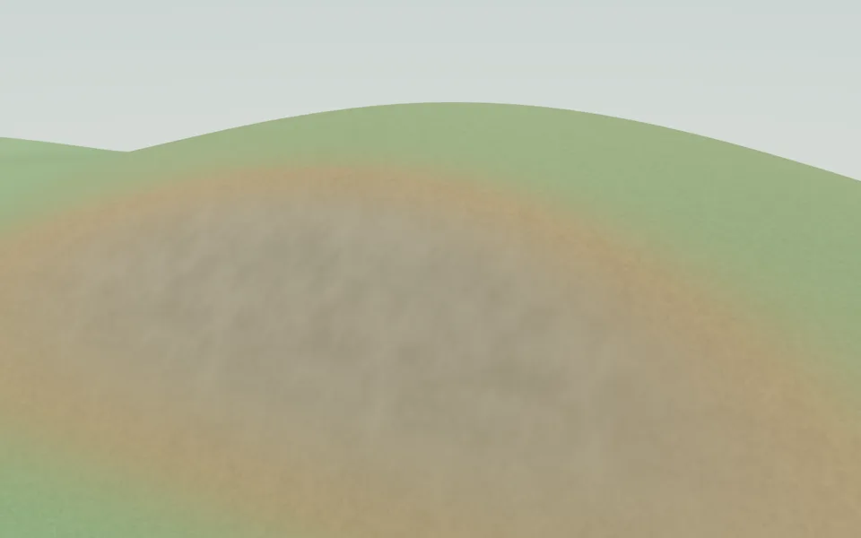
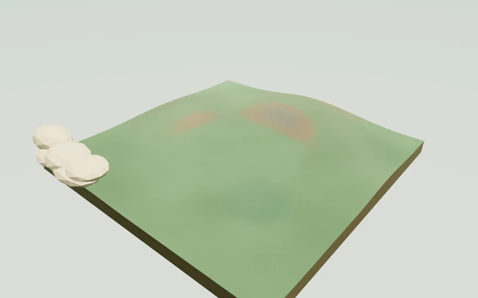
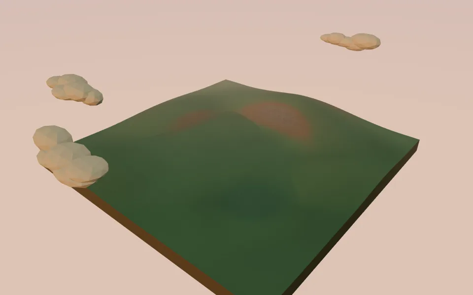
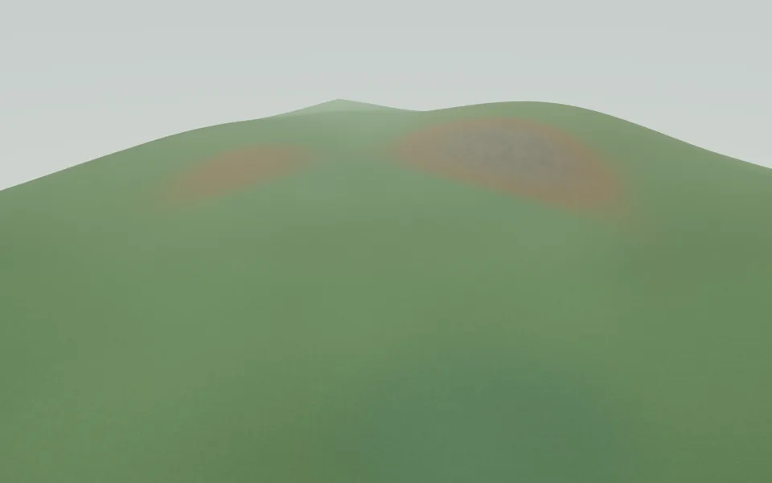
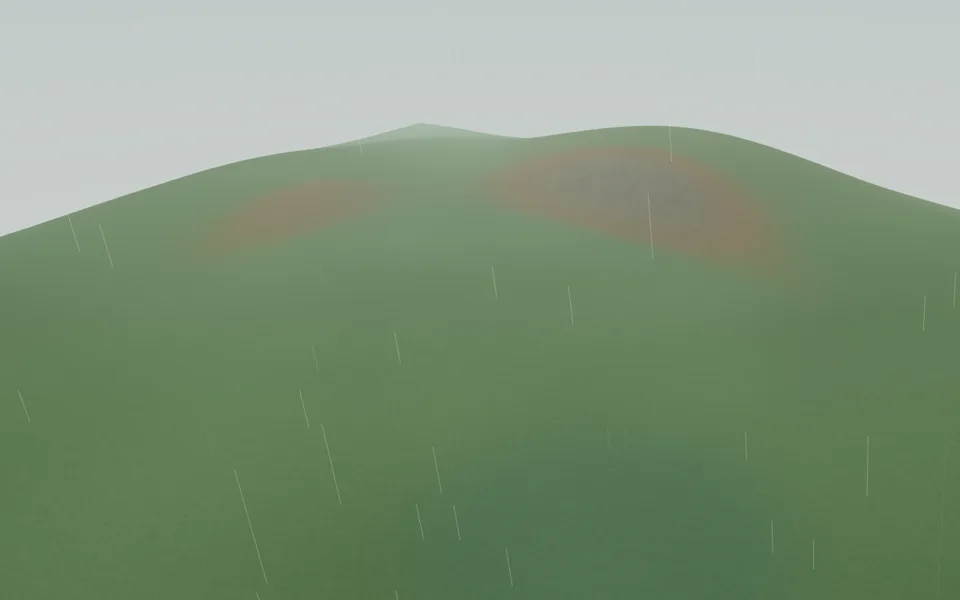
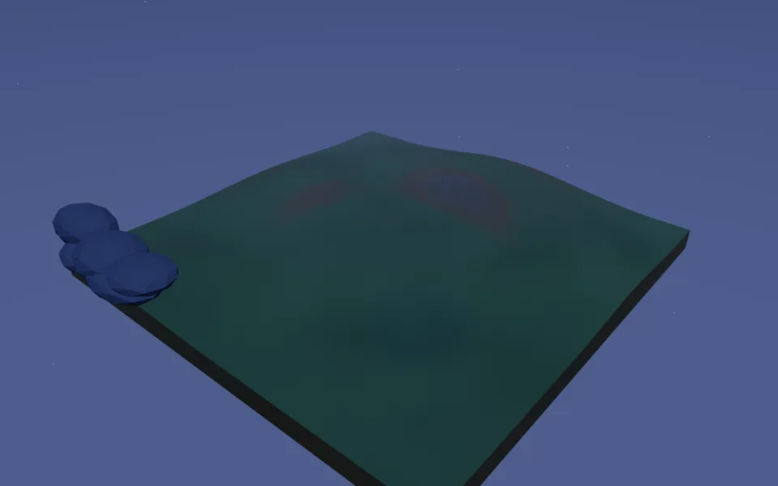
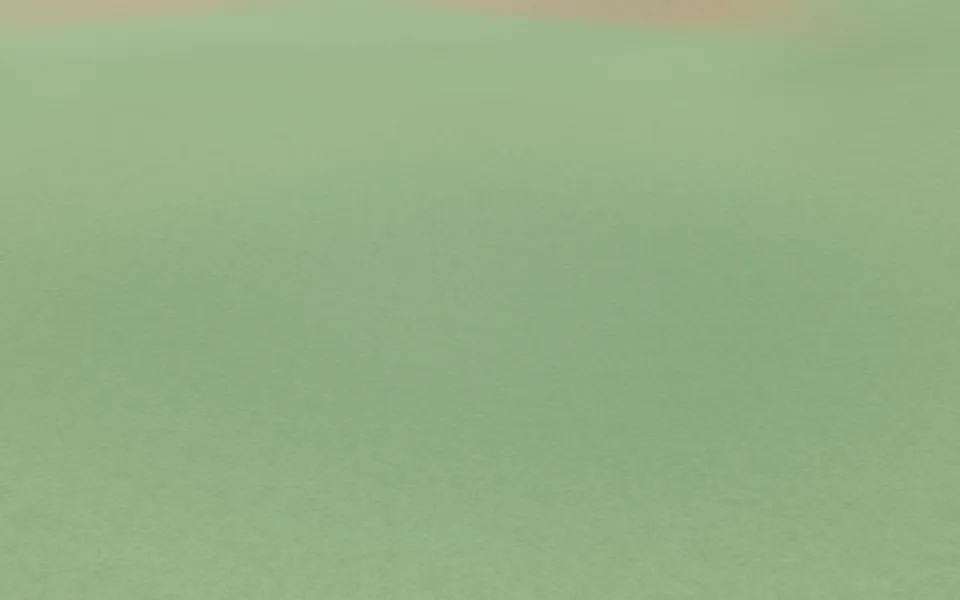

# Jelly Oasis — Terrain Surface v2

Implemented against `fb5f4fc` (master), verified 2026-10-06 KST.

## Result

The terrain keeps its original shape, topology, computed normals and cut edge.
The top now uses smooth StandardMaterial shading with grass, dry soil and rock
blended by world-space slope, height and restrained regional variation.

| Before: flat-shaded slope                                          | After: smooth layered surface                                       |
| ------------------------------------------------------------------ | ------------------------------------------------------------------- |
|  |  |

## Implementation and budget

- `createTerrain.ts` still owns the unmodified heightfield mesh; material creation
  lives in `terrainSurface.ts` and shader extensions in `terrainSurfaceShader.ts`.
- `MeshStandardMaterial.onBeforeCompile` replaces the color contribution and adjusts
  roughness. Three.js still handles lights, shadowing, fog, tone mapping and output
  color space. No displacement, extra mesh, pass or render target is introduced.
- Actual `1 - normal.y` is 0–0.212. Soil uses smooth thresholds 0.025–0.12 and rock
  0.09–0.205; the plan's illustrative 0.45 rock threshold would never be reached.
- Original meadow/highland/basin vertex colors contribute a restrained macro tint.
  Lower ground receives a cooler, slightly darker grass tone. High ground has a
  small additional soil contribution; height does not replace slope selection.
- One deterministic, original 512×512 RGBA8 DataTexture packs grass, soil, rock and
  low-frequency variation in separate linear channels. It is generated once per
  material, with periodic noise, repeat wrapping and mipmaps. No downloaded imagery
  or third-party texture license is needed.
- Detail is scalar modulation of three linear base colors, rather than three full
  color texture sets. Grass and soil use world XZ projection; rock uses triplanar.
  Six fetches per surface fragment: macro + grass + soil + three rock projections.
- Texture storage is 1 MiB base / approximately 1.33 MiB with mipmaps, plus 1 MiB
  retained CPU data for context restoration. No normal/roughness image maps.
- Roughness stays at 0.85–1.0. Normal maps and wetness were deliberately left out:
  smooth shading and subdued color detail supply the intended stylized surface
  without stronger bumps, shine or additional sampling.
- Cut-edge geometry/material remain unchanged; the top retains the muted earth
  palette without covering the cut wall in grass.
- The material owns texture disposal. The optional comparison material has a
  separate lifecycle, so leaving the inspector in legacy mode does not leak v2.

## Validation

- `npm run lint`: pass.
- `npm test`: 50 files / 273 tests passed.
- `npm run build`: pass, including TypeScript checking.
- Regression test hashes every vertex position, normal and index against the old
  mesh. Top: 12,800 triangles; cut edge: 640; total: **13,440, unchanged**.
- Real Chromium WebGL2/SwiftShader rendering: eight before/after camera pairs,
  all six diagnostic modes, fog/shadows toggles and WebGL context loss/restoration.
  No JavaScript or shader console errors in the completed run.
- Rendered app checked with a 390×844 touch viewport at device scale 3 (renderer
  caps DPR at 1.5). Mobile shadow path is disabled and page has no horizontal
  overflow. This is mobile emulation, **not a physical phone GPU/FPS benchmark**.
- Software rendering timings and the inspector's time between requested frames
  are not GPU performance measurements. No unverified device FPS claim is made.

| Scene-wide renderer counters                                        | Before |  After |
| ------------------------------------------------------------------- | -----: | -----: |
| Noon, desktop draw calls (includes shadow pass)                     |      5 |      5 |
| Noon, desktop rendered triangles (includes shadow pass/environment) | 30,768 | 30,768 |
| Texture allocations on first use                                    |      3 |      4 |
| Rain draw calls                                                     |      6 |      6 |
| Night rendered triangles                                            | 17,968 | 17,968 |
| Mobile draw calls                                                   |      — |      4 |
| Mobile texture allocations                                          |      — |      2 |

The scene-wide triangle count includes repeated shadow drawing and environment
objects; it is not the terrain geometry count.

## Visual evidence

Each pair used the same camera, time and weather, with animation paused.
Close grass and basin views showed subtle grain without an obvious repeating grid;
steep slopes lost the flat triangular boundaries. A rock/soil region remains
visible on the steep northern shoulder, as intended. The silhouette is unchanged.

| View        | Time/weather       | Camera → target           |
| ----------- | ------------------ | ------------------------- |
| Overview    | 12 / CLEAR         | (255,235,300) → (0,0,0)   |
| Grass close | 12 / CLEAR         | (36,20,45) → (0,0,0)      |
| Sunset      | 18 / PARTLY_CLOUDY | (255,235,300) → (0,0,0)   |
| Overcast    | 12 / OVERCAST      | (120,95,160) → (0,0,0)    |
| Rain        | 12 / RAIN          | (120,95,160) → (0,0,0)    |
| Night       | 0 / CLEAR          | (255,235,300) → (0,0,0)   |
| Steep slope | 12 / CLEAR         | (38,44,-29) → (10,15,-91) |
| Basin       | 12 / CLEAR         | (109,25,112) → (74,-4,64) |

| Noon                                                            | Sunset                                                     |
| --------------------------------------------------------------- | ---------------------------------------------------------- |
|  |  |
| Overcast                                                        | Rain                                                       |
|   |      |
| Night                                                           | Basin                                                      |
|         |    |

## Inspect in the app

Open `/projects/jelly-oasis/?debug=1`. Pause time or move the time slider, then
uncheck **부드러운 지표면** for the exact legacy flat-shaded material using the same
mesh and camera. Recheck it for v2. The surface selector exposes RGB layer weights,
individual weights, slope and macro variation. Texture scale and macro strength
are adjustable; `W` retains wireframe inspection. Normal browsing hides the panel.
