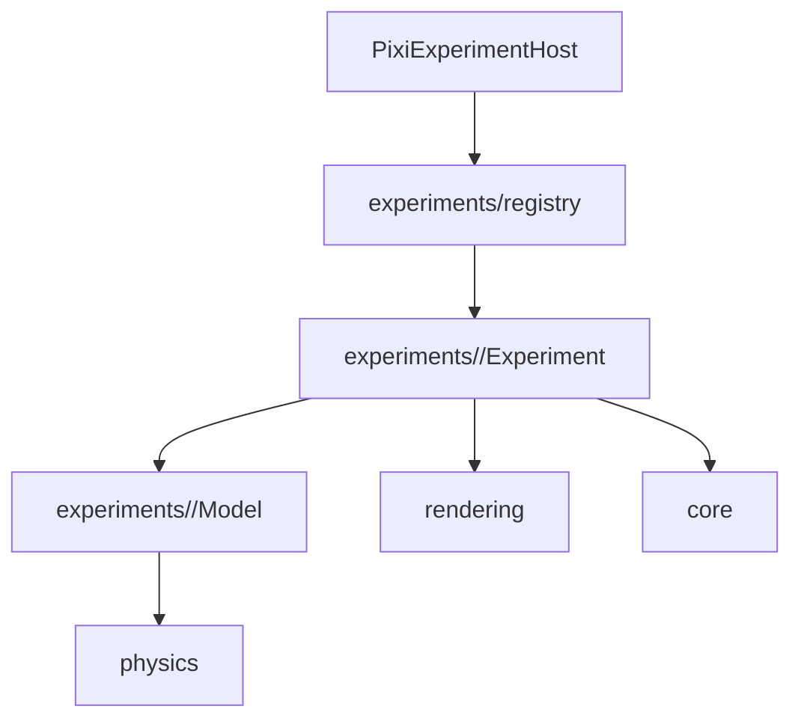

# Viola 원본 이식 가이드

Viola의 목표는 여러 실험을 비슷하게 보이게 만드는 것이 아니라, 각 C#/C++ 원본이 가진
입력, 상태, 계산 순서와 시각적 결과를 웹에서 독립적으로 재현하는 것입니다. 공통 코드는
수학·시간·좌표·렌더링처럼 의미가 같은 기반 기능에만 둡니다.

## 모듈 경계

- `core/`: 호스트 계약, 고정 시간 스텝, 기준 좌표계처럼 모든 실험에 동일한 실행 규칙
- `physics/`: 원본과 의미가 같은 작은 알고리즘만 공유하는 충돌·공간 탐색 도구
- `rendering/`: 물리 상태를 바꾸지 않는 Pixi 표현 도구
- `experiments/<id>/Model.ts`: DOM과 Pixi에 의존하지 않는 해당 실험의 상태와 계산
- `experiments/<id>/Experiment.ts`: 입력 변환, 모델 실행, 화면 동기화
- `experiments/registry.ts`: 실험 ID를 전용 구현에 연결하는 유일한 라우팅 지점
- `simulations/`: 이전 배포와의 호환을 위해 남겨 둔 구현(현재 46개 실험 라우팅에는 미사용)

전용 실험 안에서 다른 실험 ID를 분기하지 않습니다. 서로 다른 원본 알고리즘을 하나의
대형 클래스나 옵션 집합으로 합치지 않습니다. 두 실험에서 실제로 같은 책임이 확인됐을
때만 `core`, `physics`, `rendering`으로 코드를 올립니다.

## 원본 충실도 규칙

1. 원본 창 크기를 기준 월드 좌표로 유지하고 `ReferenceViewport`에서 화면에 맞춥니다.
2. 브라우저 프레임 간격은 초 단위로 받고, 모델은 `FixedRateStepper`의 고정 스텝으로
   실행합니다. 기본값은 실사용 WinForms 타이머에 가까운 60Hz이며 원본이 별도 속도를
   요구하면 실험 모듈에서 명시합니다.
3. 상수, 초기 개수, 계산 순서, 반복 횟수와 입력 키를 원본에서 직접 옮깁니다.
4. 임의 초기값이 필요한 경우 재현 가능한 seed를 사용하되 원본의 값 범위는 보존합니다.
5. 모델 테스트는 Pixi 없이 실행할 수 있어야 하며 개체 수, 토폴로지, 한 스텝의 핵심
   수식과 유한값 유지를 검증합니다.
6. 화면 최적화는 물리 결과를 바꾸지 않는 범위에서만 적용합니다. 예를 들어 입자 렌더링은
   `ParticleContainer`, 근접 탐색은 `UniformGrid`를 사용할 수 있습니다.

## 현재 이식 상태

| 분류        | 전용 구현 | 보존 범위                                    |
| ----------- | --------: | -------------------------------------------- |
| Performance |       2/2 | 7,000개 셀 분할, 1,500개 C++ 유체            |
| Physics     |       9/9 | 시간 배율, 회전·토크, 기구학, Verlet 자동차  |
| Particles   |     15/15 | 원본 개체 수, 풀 재사용, 번개·힘장·제약 계산 |
| Collisions  |       8/8 | 원-원, 선-원, 캡슐, 다각형, SAT, 선 그리기   |
| Springs     |     12/12 | 로프·천·연체·래그돌·보간·원본 이미지 픽셀    |

전체 46개 실험이 `experiments/<id>/Model.ts`와 `Experiment.ts`의 전용 구현으로
등록되어 있습니다. 호환 클래스에 실험 ID별 분기를 추가하지 않습니다.

## 이식 체크리스트

1. 원본 프로젝트의 타이머, 좌표 범위, 입력 이벤트와 초기화 코드를 기록합니다.
2. 렌더링 코드와 무관한 모델을 먼저 만들고 원본 한 틱을 그대로 옮깁니다.
3. 원본 개체 수, 연결 구조, 경계 조건과 대표 수식을 테스트로 고정합니다.
4. 기준 좌표계에서 입력과 Pixi 표시를 연결합니다.
5. `experiments/registry.ts`에 등록해 호환 구현을 해당 ID에서만 교체합니다.
6. lint, 전체 테스트, production build와 실제 상호작용을 확인합니다.
