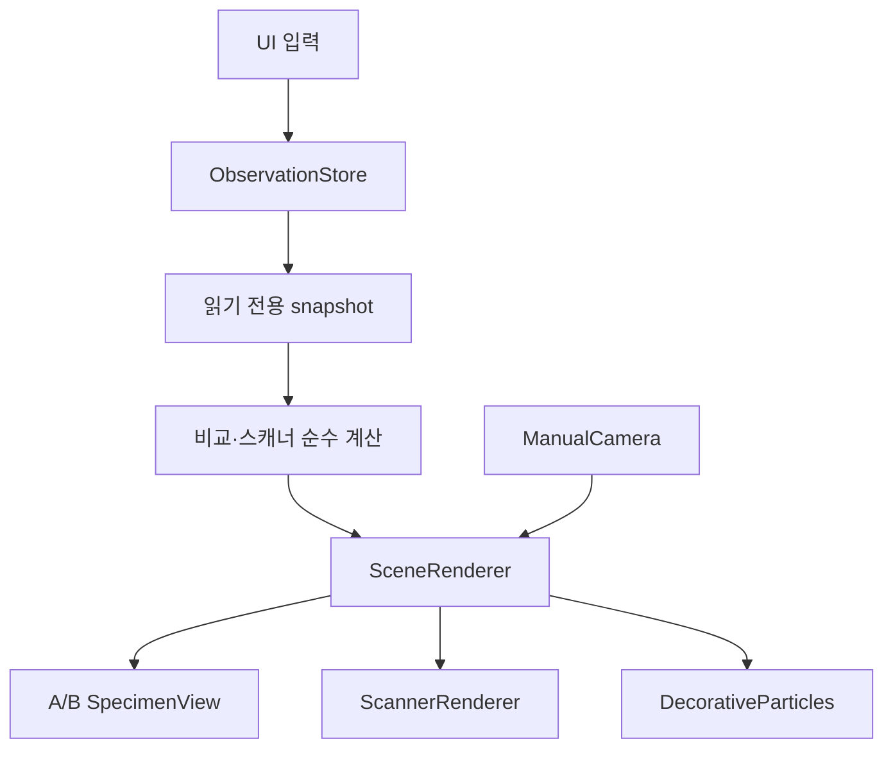

# Virus Sim v3.5 아키텍처

> 이 문서는 v3.5 당시의 역사적 구조 기록이다. 비교·변형 registry와 A/B 렌더 경로는 v4.2와
> v4.8에서 제거됐다. 현재 구조는 [`virus-sim.md`](virus-sim.md)와
> [`virus-sim-v4.8-modeling-summary.md`](virus-sim-v4.8-modeling-summary.md)를 기준으로 한다.

## 데이터 흐름

UI는 Three.js 객체를 직접 변경하지 않는다. 도감 action은 `ObservationStore`를 바꾸고,
렌더러는 복제된 snapshot을 읽어 각 view에 반영한다. 카메라 입력만 `ManualCamera`가
소유하며 orbit, pan, dolly와 사용자가 누른 `전체 보기` 외의 카메라 경로는 없다.

## 상태 소유자

| 상태                                     | 소유자                           | 비고                                                   |
| ---------------------------------------- | -------------------------------- | ------------------------------------------------------ |
| A/B 기본 항목·표본·보기·레이어·선택·분해 | `ObservationStore`               | 직렬화 가능한 데이터, 슬롯 객체와 layer map은 복제     |
| 비교 연결·크기 방식                      | `ObservationStore`               | 렌더러는 값에 따라 projection과 scale만 선택           |
| A/B 스캐너 축·위치·두께·복원값           | `ObservationStore`               | 연결 시 양쪽 probe 갱신, 해제 시 활성 슬롯만 갱신      |
| 장식 강도·정지                           | `ObservationStore`와 preferences | 과거 자동 동작 설정은 읽지 않음                        |
| 카메라 pose                              | 슬롯별 `ManualCamera`            | 명시적 사용자 action만 변경, 비교 연결 시 한 방향 복사 |
| Three.js scene·model·material            | 슬롯별 `SpecimenView`            | 다른 슬롯과 mutable 객체를 공유하지 않음               |
| renderer·RAF·viewport·render target      | `SceneRenderer`                  | 전 앱에 하나                                           |

## 모듈 책임

| 경로                                       | 책임                                     | 금지한 책임                     |
| ------------------------------------------ | ---------------------------------------- | ------------------------------- |
| `catalog/types.ts`                         | 도감·치수·표본·근거 계약                 | DOM, Three.js, 카메라           |
| `catalog/definitions/`                     | 71개 identity 데이터                     | UI 분기, 자동 경로              |
| `catalog/dimensions.ts`                    | 대표 나노미터 값과 범위                  | procedural bounds로 치수 추정   |
| `catalog/variants/registry.ts`             | 표본 관계와 검증된 영역 차이             | 서열 예측, 임의 외형 변화       |
| `comparison/scaling.ts`                    | viewport와 nm-per-pixel 순수 계산        | scene·camera 생성               |
| `inspection/transition.ts`                 | peel·cutaway·explode·reassemble 평가     | 카메라 이동                     |
| `observation/ObservationStore.ts`          | 단일 관찰 상태와 action                  | DOM 선택자, 렌더 객체           |
| `rendering/ManualCamera.ts`                | 수동 카메라와 명시적 fit                 | timer, waypoint, idle 동작      |
| `rendering/SpecimenView.ts`                | model·레이어·단면·분해·선택              | UI와 camera 직접 조작           |
| `rendering/SceneRenderer.ts`               | 단일 renderer/RAF, A/B pass, 입력 라우팅 | 도감 사실의 소유                |
| `rendering/scanner/ScannerRenderer.ts`     | 기존 renderer의 slab pass와 canvas 복사  | 두 번째 WebGL context·상태 원천 |
| `rendering/effects/DecorativeParticles.ts` | 장식 shader·성능별 particle 예산         | 표본 pose·scale·picking 변경    |
| `ui/VirusSimPanel.ts`                      | 도감·관찰 패널 표시와 로컬 설정          | Three.js 모델 생성              |
| `ui/bindings.ts`                           | DOM 이벤트를 typed action으로 변환       | 관찰·렌더 상태 소유             |
| `app.ts`                                   | store·renderer·panel 연결과 해제         | 대량 DOM 갱신, 모델별 분기      |

## 렌더 순서

1. container 크기에서 단일 또는 A/B viewport를 계산한다.
2. 비교가 `normalized`면 perspective camera와 각 모델의 화면용 대표 길이를 사용한다.
3. 비교가 `physical`이면 공통 nm-per-pixel과 orthographic camera를 사용한다.
4. A, B 순서로 같은 WebGL renderer에 viewport/scissor를 지정해 main scene을 렌더한다.
5. 스캐너가 켜지고 signature가 바뀐 경우에만 활성 슬롯의 실제 geometry에 두 clipping
   plane을 적용해 render target에 그린다.
6. 스캔 픽셀을 2D canvas에 복사하고 material clipping, 장식 visibility, render target,
   viewport, scissor, auto-clear와 clear color를 원복한다.

장식이 움직이는 동안이나 구조 전환 중에는 지속 렌더한다. 장식을 끄거나 정지하고 구조
전환도 없으면 입력·resize·상태 변경이 `show()`를 호출할 때만 WebGL 장면을 다시 그린다.
스캐너는 상태 signature가 같으면 다시 계산하지 않는다.

## 자원 수명

- `SceneRenderer` 생성 시 WebGL renderer, 두 scene, 두 camera, 장식 레이어와 scanner
  render target을 한 번 만든다.
- 종 또는 품질 변경 시 해당 슬롯 `SpecimenView`의 geometry와 material을 dispose하고 새
  모델을 만든다. 카메라는 교체하지 않아 pose가 유지된다.
- 비교 종료 시 B view만 dispose하며 A view와 renderer는 유지한다.
- scanner pass는 model material을 임시 변경하고 `finally`에서 반드시 복원한다.
- 앱 dispose 시 ResizeObserver, canvas 입력·WebGL listener, 두 view, particle geometry와
  material, scanner render target과 renderer를 정리한다.
- UI listener는 `bindings.ts`의 단일 AbortController로 함께 해제한다.
- 비동기 모델 로딩은 사용하지 않으므로 늦은 요청 경쟁이 없다.

## 구 코드에서 v3.5로의 대응

| v3 파일/기능                                    | v3.5 처리                                        |
| ----------------------------------------------- | ------------------------------------------------ |
| `experience/ExperienceDirector.ts`              | 삭제. idle 자동 다큐 없음                        |
| `experience/ExperienceState.ts`                 | 삭제. 수동 상태는 `ObservationStore`로 통합      |
| `experience/ObservationMomentDetector.ts`       | 삭제. 자동 관찰 순간 없음                        |
| `catalog/experienceProfiles.ts`                 | 삭제. Hero와 내부 카메라 경로 없음               |
| `observation/ObservationController.ts`          | `ObservationStore`로 교체                        |
| `observation/motion/`                           | 삭제. 표본 전체 자동 이동·회전 없음              |
| `observation/specimen/SpecimenPersonality.ts`   | 삭제. pose 변형 성향 없음                        |
| `observation/tours/`                            | 삭제. 자동 구조 투어 없음                        |
| `rendering/CameraRig.ts`                        | timer 없는 `ManualCamera`로 교체                 |
| `rendering/ObservationView.ts`, `VirusScene.ts` | `SpecimenView`와 `SceneRenderer`로 책임 분리     |
| `rendering/environment/FluidAmbience.ts`        | 의미 없는 장식 전용 `DecorativeParticles`로 교체 |
| `rendering/postfx/FocusController.ts`           | 삭제. 부위 선택이 카메라를 움직이지 않음         |
| `time/TimeLens.ts`, `MotionTrace.ts`            | 삭제. 시간 배율·흔적·echo 없음                   |

정의 파일의 `motionProfileId`, `localMotion`, `tourParts` 필드와 관련 CSS·UI 식별자도
함께 제거했다.
