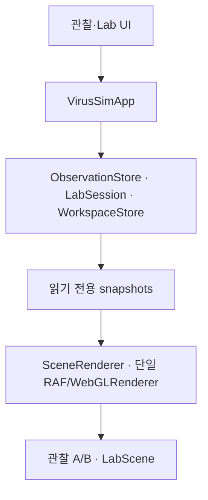

# Virus Sim v4 아키텍처

## 상태와 데이터 흐름

UI는 Three.js 객체나 물리 world를 직접 변경하지 않는다. `VirusSimApp`은 typed action을
세 상태 소유자에 전달하고, 렌더러는 관찰 또는 Lab의 discriminated snapshot만 읽는다.
기존 관찰 scene 경로는 그대로 보존하고 새 실험 geometry와 marker는 `LabScene` 아래에
격리했다.

## 상태 소유자

| 상태                                            | 소유자                      | 경계                            |
| ----------------------------------------------- | --------------------------- | ------------------------------- |
| 관찰 A/B, 레이어, 분해, 스캐너, 변이            | `ObservationStore`          | Lab 물리 상태를 알지 않음       |
| Lab config, world, PRNG, sim-time, 결과, replay | `LabSession`                | DOM·Three.js를 알지 않음        |
| 현재 모드와 모드별 탭                           | `WorkspaceStore`            | 도감·물리 내용을 소유하지 않음  |
| 관찰 A/B 카메라 pose                            | A/B `ManualCamera`          | 자동 경로·idle motion 없음      |
| Lab 카메라 pose                                 | `LabScene`의 `ManualCamera` | 관찰 pose와 공유하지 않음       |
| WebGL renderer, RAF, 입력 라우팅                | `SceneRenderer`             | 물리 적분을 수행하지 않음       |
| Lab 외형·챔버·trajectory·flow marker            | `LabScene`                  | snapshot을 표시하고 자원을 관리 |
| 하단 패널 scroll 위치                           | `VirusSimPanel`             | 모드·탭별 위치를 별도 저장      |

## 주요 모듈

| 경로                                  | 책임                                                        |
| ------------------------------------- | ----------------------------------------------------------- |
| `workspace/WorkspaceStore.ts`         | 관찰/Lab 모드와 탭 전이                                     |
| `lab/LabSession.ts`                   | 상태기계, fixed-step clock, 명령 기록, 결과, restart/replay |
| `lab/types.ts`                        | 직렬화 가능한 Lab 공개 계약                                 |
| `lab/physics/`                        | 순수 vector·PRNG·velocity field·world step                  |
| `lab/profiles/registry.ts`            | 71개 항목의 버전된 physics profile과 크기 환산              |
| `lab/chambers/descriptors.ts`         | 렌더와 충돌이 함께 읽는 chamber/obstacle descriptor         |
| `lab/measurements.ts`                 | 실제 world 위치 기반 bounded trajectory                     |
| `lab/persistence.ts`                  | schema/engine 검증과 단일 설정 슬롯                         |
| `rendering/lab/LabScene.ts`           | Lab render 자원과 수동 카메라                               |
| `rendering/lab/LabSpecimenView.ts`    | profile과 같은 축·scale·centerline의 경량 외관              |
| `rendering/lab/LabFlowMarkers.ts`     | physics와 같은 `sampleVelocityField`를 읽는 marker          |
| `ui/LabPanel.ts`, `ui/labBindings.ts` | snapshot 표시와 DOM event/action 변환                       |
| `rendering/SceneRenderer.ts`          | 기존 관찰 A/B와 Lab pass를 한 renderer/RAF로 조정           |

## 프레임과 모드 전환

`SceneRenderer.start()`만 연속 `requestAnimationFrame` loop를 등록한다. 매 프레임 앱에서 현재 모드의
snapshot을 한 번 받고, Lab은 `running`이거나 sim-time이 바뀐 때만 다시 그린다. 관찰은
구조 전환 또는 장식 animation이 있을 때 계속 그리며, 정지 화면은 입력·상태 변경·resize 때
그린다. `ResizeObserver` callback은 다음 animation frame으로 합쳐 중복 resize를 피한다.

구조 관찰 진입은 작은 transaction이다.

1. Lab을 `inspecting`으로 정지한다.
2. 원래 `ObservationSnapshot`, A/B camera pose, Lab camera pose와 패널 위치를 보관한다.
3. 선택한 Lab 항목을 기존 고품질 관찰 A에 임시로 연다.
4. 복귀 시 원래 관찰 snapshot과 A/B pose를 복원하고 Lab은 `paused`로 남긴다.

실험 순간의 filament 굽힘, Lab scale, 관찰 분해·단면은 서로 복사하지 않는다.

## 자원 수명

- WebGLRenderer와 canvas는 앱당 하나만 생성하고 mode 전환 때 DOM에서 옮기지 않는다.
- Lab instance 추가·삭제 시 해당 `LabSpecimenView`만 생성·dispose한다.
- 품질 변경은 Lab view와 marker budget을 다시 만들되 physics world와 PRNG를 건드리지 않는다.
- trajectory line은 사라진 instance의 geometry/material을 즉시 dispose한다.
- chamber descriptor signature가 바뀔 때만 chamber geometry를 다시 만든다.
- 앱 dispose 시 ResizeObserver, 입력 listener, 관찰 view, Lab view, scanner target, marker,
  renderer를 정리한다. UI listener는 AbortController 두 개로 일괄 해제한다.

기존 관찰 구현을 대규모로 이동시키지 않고 Lab 전용 책임만 새 모듈로 분리했다. 이 선택은
검증된 A/B·scanner 경로의 회귀 위험과 새 코드의 결합도를 함께 낮춘다.
